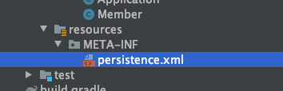
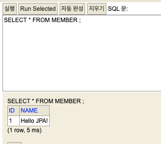

# 1. JPA 실습 환경 구축

요구 사항은 다음과 같다.  

- up to JDK 8
- H2 Database
- Gradle

## 1.1 H2 Database 준비

우선 도커로 실습할 `H2 Database`를 띄워보자.  

```text
docker run -d -p 1521:1521 -p 8282:81 -e H2_OPTIONS='-ifNotExists' --name=local_h2 oscarfonts/h2:1.4.199
```

일단 공식 이미지는 아니므로 운영에 사용할 일이 있다면 절대로 쓰지 말자.  
옵션으로는 `ifNotExists`를 주었는데, 컨테이너에서 h2가 구동될 때 파일이 없으면 생성하도록 했다.  
어차피 이 데이터를 쓸 일은 없으므로 볼륨 마운트 또한 하지 않았다.  

동작 확인을 위해 다음 주소로 접속해보자.  

[http://localhost:8282/](http://localhost:8282/)

잘 동작했다면 끝.  

## 1.2 Gradle Project

각자 편한 IDE를 선택 후, `build.gradle`을 다음과 같이 편집한다.  

```gradle
plugins {
    id 'java'
}

group 'xyz.hyeyoom'
version '1.0-SNAPSHOT'

sourceCompatibility = 11

repositories {
    mavenCentral()
}

dependencies {
    testCompile group: 'junit', name: 'junit', version: '4.12'
    // H2 Database
    compile group: 'com.h2database', name: 'h2', version: '1.4.200'
    // JPA Hibernate
    compile group: 'org.hibernate', name: 'hibernate-entitymanager', version: '5.4.8.Final'
}
```

의존성으로는 H2 database와 하이버네이트 엔티티 매니저를 추가했다.  
그레이들로 구성한 프로젝트이므로 `main` 아래에 `java`, `resources`가 있을텐데, `resource/META-INF/persistence.xml`를 생성하자.  



내용은 다음과 같다.  

```java
<?xml version="1.0" encoding="UTF-8"?>
<persistence version="2.2"
             xmlns="http://xmlns.jcp.org/xml/ns/persistence" xmlns:xsi="http://www.w3.org/2001/XMLSchema-instance"
             xsi:schemaLocation="http://xmlns.jcp.org/xml/ns/persistence http://xmlns.jcp.org/xml/ns/persistence/persistence_2_2.xsd">
    <persistence-unit name="hello-jpa">
        <class>xyz.hyeyoom.jpa_studying.Member</class>
        <properties>
            <!--required-->
            <property name="javax.persistence.jdbc.driver" value="org.h2.Driver"/>
            <property name="javax.persistence.jdbc.user" value="sa"/>
            <property name="javax.persistence.jdbc.password" value=""/>
            <property name="javax.persistence.jdbc.url" value="jdbc:h2:tcp://localhost:1521/test"/>
            <property name="hibernate.dialect" value="org.hibernate.dialect.H2Dialect"/>

            <!--optional-->
            <property name="hibernate.show_sql" value="true"/>
            <property name="hibernate.format_sql" value="true"/>
            <property name="hibernate.use_sql_comments" value="true"/>
            <property name="hibernate.hbm2ddl.auto" value="create"/>
        </properties>
    </persistence-unit>
</persistence>
```
`hibernate.hbm2ddl.auto`이 `true`이므로 테이블이 알아서 생성될 것이다.  

이렇게 한 뒤 `Member` 클래스를 정의해보자.  

```java
package xyz.hyeyoom.jpa_studying;

import javax.persistence.Entity;
import javax.persistence.GeneratedValue;
import javax.persistence.Id;

@Entity
@Getter
@Setter
@ToString
public class Member {

    @Id
    @GeneratedValue
    private Long id;

    private String name;

}
```

그리고 main 메소드에 다음과 같이 작성한다.  

```java
package xyz.hyeyoom.jpa_studying;

import javax.persistence.EntityManager;
import javax.persistence.EntityManagerFactory;
import javax.persistence.EntityTransaction;
import javax.persistence.Persistence;

public class Application {

    public static void main(String[] args) {
        EntityManagerFactory emf =
                Persistence.createEntityManagerFactory("hello-jpa");
        EntityManager em = emf.createEntityManager();
        EntityTransaction tx = em.getTransaction();

        tx.begin();
        try {
            Member member = new Member();
            member.setName("Hello JPA!");

            em.persist(member);
            tx.commit();
        } catch (Exception e) {
            tx.rollback();
        } finally {
            em.close();
        }
        emf.close();
    }
}
```

그리고 웹 콘솔에 접속하여 조회를 해보자.  



이렇게 나오면 이제 실습 진행 삽가능.  

# 2. 데이터베이스 방언

XML 설정을 보면 다음과 같은 속성이 존재한다.  

```text
property name="hibernate.dialect" value="org.hibernate.dialect.H2Dialect"/>
```

여기서 중요한 것은 `dialect`라는 것인데, JPA가 이 dialect를 사용한다. 이것은 여러 벤더로부터 독립적으로 동작하기 위함이다.  
SQL은 `ANSI SQL`이 지켜지면 참 좋겠지만 현실은 그렇지 못하다. 각 RDB마다 사용하는 함수나 문법이 조금씩 다르기 때문이다.   

따라서 이러한 dialect를 두어 구현체를 만들고 이를 사용하는 것이다.  

# 3. JPA 구동 방식

앞선 코드에서 다음과 같은 부분이 있다.  

```java
EntityManagerFactory emf =
                Persistence.createEntityManagerFactory("hello-jpa");
EntityManager em = emf.createEntityManager();
EntityTransaction tx = em.getTransaction();
```

앞서 작성했던 `persistence.xml`의 정보를 토대로 `EntityManagerFactory`를 만들고, 이것으로 `EntityManager`를 생성해서 이를 사용한다.  

여기서 주목할 것은 `EntityManager`인데 엔티티 매니저는 JPA의 일부이며, 이 엔티티 매니저의 API를 사용하여 `영속성 컨텍스트(Persistence Context)`에 접근한다.  

여기서 주의할 것은

- 엔티티 매니저 팩토리는 애플리케이션 당 하나(싱글톤)여야 함
- 엔티티 매니저는 스레드간 공유를 해선 안됨(커넥션, 데이터 문제 등)
- JPA 모든 데이터 변경은 트랜잭션 내에서

이러한 내용들을 알고 있어야 한다.  

# 4. CRUD in JPA

JPA로 CRUD를 해보자. 앞에서도 질리게 한 거 같은 기분은 착각임!  

## 4.1 CREATE

우선 회원 10명을 넣어보자.  

```java
for (int i = 0; i < 10; i++) {
    Member member = new Member();
    member.setName("member" + i);
    em.persist(member);
}
```

## 4.2 READ

회원을 찾아보자.  

```java
Member member = em.find(Member.class, 1L);
System.out.println(member);
```

## 4.3 UPDATE

찾은 회원의 이름을 바꿔보자.  

```java
Member member = em.find(Member.class, 1L);
System.out.println(member);
member.setName("나는회원이다");
System.out.println(member);
```

그냥 객체 바꾸듯 하면 끝이다.  

## 4.4 DELETE

회원을 지우자.  

```java
Member member = em.find(Member.class, 1L);
em.remove(member);
```

아주 간단하다.  

# 5. JPQL

간단 요약:

> JPQL은 엔티티 객체를 대상으로 하는 쿼리
> SQL은 데이터베이스를 대상으로 하는 쿼리
> JPQL은 객체지향 SQL

뭔가 조건을 가지고 조회를 해보고 싶다면 어떻게 해야할까?  
이 때 JPQL을 사용한다.  

id가 5보다 큰 회원들을 fetch해보자!  

```java
List<Member> members = em
    .createQuery("SELECT m FROM Member m WHERE m.id > 5", Member.class)
    .getResultList();
members.forEach(System.out::println);
```

참고로 IDE의 도움을 받으려면 테이블 이름을 클래스 이름과 일치시키면 잘 도와준다.  

이렇게 하면 결과는 다음과 같다.  

```text
select
    member0_.id as id1_0_,
    member0_.name as name2_0_ 
from
    Member member0_ 
where
    member0_.id>5
Member{id=6, name='member5'}
Member{id=7, name='member6'}
Member{id=8, name='member7'}
Member{id=9, name='member8'}
Member{id=10, name='member9'}
```

