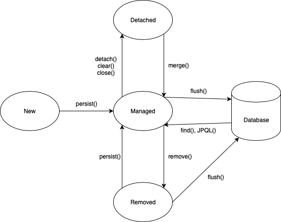
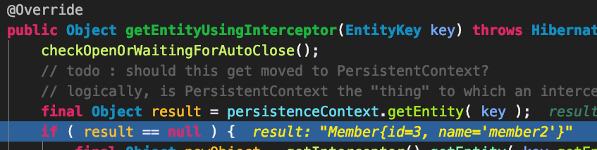
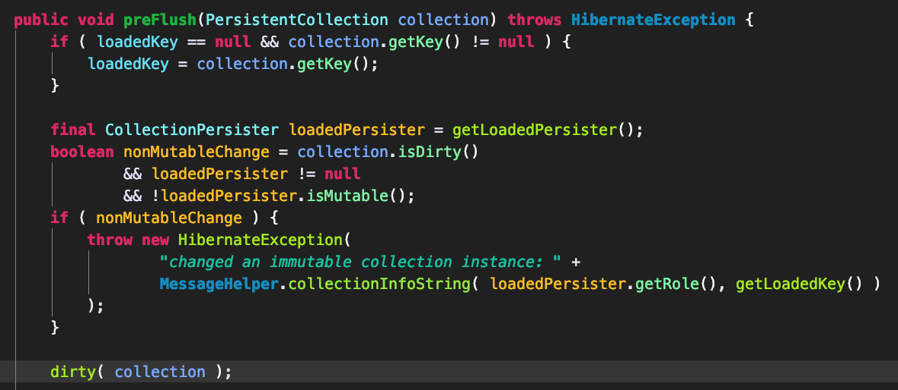
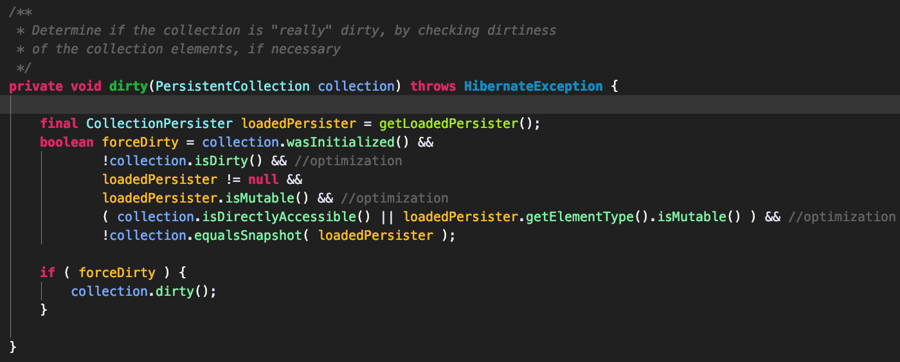
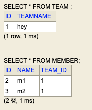
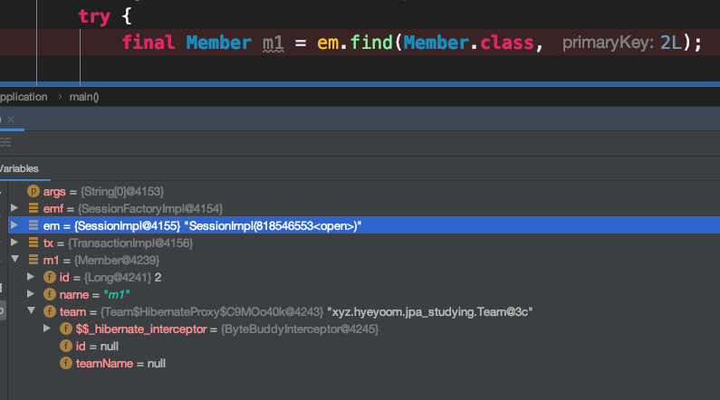

# 1. 영속성 컨텍스트(Persistence Context)

영속성 컨텍스트(~~PC!?~~)는 JPA를 이해하기 위한 핵심 개념이다.  

영속성 컨텍스트란:  

> 영속화 저장소에 영속화 될 데이터를 지닌 엔티티의 집합을 다루는 것

여기서 알 수 있는 것은 

1. 영속화 컨텍스트에는 하나 이상의 엔티티가 있다는 것
2. 이 엔티티는 영속화 될 데이터를 가지고 있다는 것

한 마디로 `데이터를 영구 저장하기 위한 것`이다.  
그리고 이 전 장에서 정리한 `EntityManager`를 통해 영속성 컨텍스트에 접근하고 이를 다룬다.  

## 1.1 Entity Lifecycle

엔티티에는 네 개의 생명 주기가 존재한다.  

(1) 비영속(new/transient)  
객체가 생성 되었을 때의 상태. 영속성 컨텍스트에 관리가 되지 않는 상태.  

(2) 영속(managed)  
영속성 컨텍스트에 의해 관리되는 상태.  

(3) 준영속(detached)  
영속성 컨텍스트에서 분리된 상태.  

(4) 삭제(removed)  
삭제된 상태.  



### 1.1.1 비영속(New/Transient)

영속성 컨텍스트의 관리를 받지 않는 상태이다.  
즉 다음과 같은 상태이다.  

```java
Member m1 = new Member();
m1.setName("횐님^^");
```

이 상태는 그냥 평범한 객체 생성일 뿐. 그 이상 그 이하도 아님.  

### 1.1.2 영속(managed)

영속 컨텍스트에 관리가 되는 상태이다. 즉, 해당 객체는 영속화 될 데이터라는 뜻이다.  

```java
em.persist(m1);
```

### 1.1.3 준영속(detached)

다이어그램에도 나와 있지만 detach, clear, close 등이 호출된 경우이다. 이 경우에는 영속성 컨텍스트에서 분리된다.  

```java
em.detach(entity);
em.clear();
em.close();
```

### 1.1.4 삭제(removed)

삭제 된 상태.

```java
em.remove(m1);
```

# 2. 영속성 컨텍스트를 통한 이점

영속성 컨텍스트를 통해 얻는 이점은 다음과 같다.  

- 1차 캐시(1st level cache)
- 동일성(identity) 보장
- 트랜잭션을 지원하는 쓰기 지연(transactional write-behind)
- 변경 감지(dirty checking)
- 지연 로딩(lazy loading)

하나하나 정리해보자.  

## 2.1 1차 캐시(first level cache)

엔티티를 persist하거나 find나 JPQL을 통해 찾아서 `managed(영속)` 상태가 된 경우 엔티티는 1차 캐시에 저장된다.  

그래서 1차 캐시에 저장된 엔티티는 다시 조회하면 쿼리 없이 바로 1차 캐시에서 꺼내온다. 물론 이는 트랜잭션 한정이기 때문이라 이를 통해 얻는 성능적 이득은 소소하다.  

하이버네이트 코드 부분 참조:

```java
SessionImpl#getEntityUsingInterceptor
// ...
persistenceContext.getEntity(key);
// StatefulPersistenceContext 참고
```



이 부분에서 캐싱된 것을 가져오는 것을 확인할 수 있다.  

## 2.2 동일성 보장(identity)

앞서 설명한 바와 같이 1차 캐시에 저장되기 때문에 DB에서 조회하거나 저장된 엔티티는 동일성을 보장받을 수 있다.  

또한 1차 캐시로 트랜잭션 격리 수준을 애플리케이션 레벨에서 이룰 수 있다는 점도 기억해두자.  

## 2.3 트랜잭션을 지원하는 쓰기 지연(transactional write-behind)

트랜잭션이 시작되어 커밋으로 마무리되기 전 까지 모든 INSERT 쿼리를 모았다가 한 번에 실행시킨다.  

이와 관련된 것은 `ActionQueue`를 참고할 것.  
ActionQueue는 세션의 트랜잭션 쓰기 지연의 일부로, DML 연산 큐를 갖고 있다.  

https://docs.jboss.org/hibernate/orm/5.3/javadocs/org/hibernate/engine/spi/ActionQueue.html

코드는 다음을 참고하면 된다.  

```java
JdbcResourceLocalTransactionCoordinatorImpl#commit
```

## 2.4 변경 감지(dirty checking)

변경 감지는 엔티티의 수정을 감지하여 트랜잭션이 커밋될 때 자동으로 알아서 반영해주는 메커니즘을 말한다.  

정확히는 `flush`가 발생하기 전인 `preFlush`에서 검사를 수행한다.  

`CollectionEntity`의 preFlush부분



dirty 메소드를 보면 다음과 같다.  



컬렉션 인터페이스에 정의된 `PersistentCollection#equalsSnapshot`부분이 바로 현재 상태와 스냅샷이 일치하는지 체크하는 부분이다.  
성능상 이점을 위해 AND 연산으로 도배해 SCE로 최적화를 시도하는 모습이 보인다.  

심심하면 구현체도 읽어보면 도움이 될 것이다.  

## 2.5 지연 로딩(lazy loading)

다음과 같이 두 엔티티가 있다고 가정 해보자.  

팀을 표현하는 팀 엔티티

```java
@Entity
@Getter
@Setter
@ToString
@EqualsAndHashCode(of = "id")
public class Team {

    @Id
    @GeneratedValue
    private Long id;

    private String teamName;
}
```

멤버를 표현하는 멤버 엔티티

```java
@Entity
@Getter
@Setter
@ToString
@EqualsAndHashCode(of = "id")
public class Member {

    @Id
    @GeneratedValue
    private Long id;

    private String name;

    @OneToOne(fetch = FetchType.LAZY)
    private Team team;
}
```

그리고 다음과 같이 저장되어 있다고 가정해보자.  



1:1 관계이고 fetch가 lazy로 설정되어 있다. 따라서 getTeam을 호출하지 않는 이상 team에는 아무것도 없다. (toString으로 인한 것도 포함해야 하기 때문에 주의)  

디버깅을 통해보자.  



보면 team에 아무것도 없다는 사실을 알 수 있다.  
하지만 한 가지 특이한 점을 볼 수 있는데 Team이 아닌 Team에 대한 프록시가 설정되어 있다는 것을 확인할 수 있다.  

ByteBuddyInterceptor는 `BasicLazyInitializer`의 구현체중 하나로 (아마) 기본적으로 사용되며, 다른 친구는 `JavassistLazyInitializer`가 있다. (javaassit 기반으로 구현)  

이렇게 프록시가 주입되어 get이 invoke되면 그 때 db에서 갖고 온 뒤 팀 또한 `managed` 상태가 된다.  

fetch를 lazy로 할지 eager로 할 지는 사용되는 객체의 특성에 따라서 판단하는 것이 옳다.  

위의 예제의 경우 팀과 멤버가 항상 동일하게 사용된다면 이는 `eager`가 옳을 것이고, 아닌 경우에는 lazy를 쓰는 것이 성능 상의 이점을 가지게 될 것이다.  

