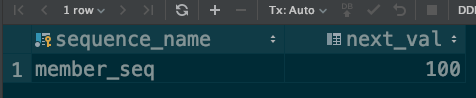

# 1. 엔티티 매핑

|Target|Annotation|Description
|-|-|-|
|객체|@Entity|객체를 매핑한다|
|테이블|@Table|테이블 이름 별도 지정|
|기본키|@Id|PK 지정|
|필드-칼럼|@Column|필드와 칼럼 매핑|
|릴레이션|@OneToOne|일대일|
|릴레이션|@OneToMany|일대다|
|릴레이션|@ManyToMany|다대다|
|릴레이션|@JoinColumn|조인|

# 2. 객체-테이블 매핑

`@Entity`로 지정된 클래스는 엔티티라 부르며 JPA에 의해 관리된다.  
또한 테이블과 매핑되며, 기본적으로 클래스의 이름이 테이블 이름이 된다.  

테이블 이름을 별도로 지정하고 싶다면 `@Table(name = "members")`와 같이 `@Table` 어노테이션의 name에 지정을 해준다.  

이 때 주의할 점은 다음과 같다.  

- Non private
- constructor without parameters
- Non final (proxy 불가, 필드 포함)
- enum, interface, inner class (당연..)

가급적 unique로 지정할 필드는 @Table의 `uniqueConstraints`를 사용하는 것이 좋다.  
왜냐하면 unique로 걸게 되면 JPA에서 지정한 랜덤한 문자열을 가진 constraint가 걸리며, 이는 에러 추적에 방해요소가 되기 때문이다.  

# 3. 스키마 자동 생성

DDL을 애플리케이션이 구동될 때 날린다. 연결한 DB에 맞는 적절한 방언을 이용해 맞춤으로 날아간다.  

하지만 DDL 사용은 가급적 비추이며 특히 운영에서는 절대 쓰면 안된다.  

애초에 운영에 사용되는 DB 계정은 별도로 분리하여 DDL을 날릴 권한을 주지 않는 것이 옳다.  

옵션은 다음과 같다.  

|Option|Description|
|-|-|
|create|drop existing tables and create|
|create-drop|drop tables when application is going to be terminated|
|update|update delta|
|validate|check mapping validation|
|none|no-op|

# 4. 필드와 칼럼

필드-칼럼 매핑과 관련된 어노테이션은 다음과 같다.  

|어노테이션|설명|
|-|-|
|@Column|칼럼|
|@Enumerated|enum타입(디폴트: ordinal, enumerated)|
|@Temporal|날짜, 시간|
|@Lob|BLOB, CLOB|
|@Transient|transient와 동일함|

참고로 `@Enumerated`는 ORDINAL이 기본이고 쓰지 않는 것이 좋다.  

# 5. 기본 키 매핑과 키 생성 전략

우선 기본 키 매핑과 관련된 어노테이션은 다음과 같다.  

|어노테이션|설명|
|-|-|
|@Id|기본 키를 지정|
|@GeneratedValue|키 자동 생성|

키를 직접 설정하고 싶다면 `@Id`만 달아주면 된다.  

자동 생성 전략은 다음과 같다.  

|전략|설명|
|-|-|
|AUTO|방언에 맞게 자동으로 지정(default)|
|IDENTITY|DB에 위임|
|SEQUENCE|DB 시퀀스 오브젝트 사용 - Oracle, Postgresql(@SequenceGenerator 필요)|
|TABLE|키 생성용 테이블 사용(@TableGenerator 필요)|

이제 각각의 전략에 대해 살펴보자.  

## 5.1 IDENTITY 전략

- 키 생성을 DBMS에 위임
- 이건 auto increment나 serial 타입이 있는 MySQL이나 Postgresql 같은 친구들이 대표적!
- AI(자동증가)나 serial은 쿼리가 실행 된 후에 키를 알 수 있게 됨
- 하지만 JPA는 트랜잭션 커밋 시점에 INSERT가 실행 됨
  - 따라서 이 경우에는 persist하는 시점에 INSERT 쿼리가 실행됨

다음 코드를 통해 확인해보자. 타겟 DB는 postgresql이다.  

```java
@Entity
@Setter
@Getter
@ToString
public class Member {

    @Id
    @GeneratedValue(strategy = GenerationType.IDENTITY)
    private Long id;

    private String name;
}
```

그리고 이를 실행하는 코드이다.  

```java
Member m1 = new Member();
m1.setName("hyeyoom");

System.out.println("before persist ");
em.persist(m1);
System.out.println("after persist ");

tx.commit();
```

결과는 다음과 같다.  

```text
before persist 
Hibernate: 
      insert 
        into
            Member
            (name) 
        values
            (?)
after persist 
```

트랜잭션 발생 전에 insert가 실행되었다.  
이는 DB 때문에 생기는 제약이므로 어쩔 수 없다. 이러한 일이 발생한다는 사실을 인지하면 됨.

## 5.2 SEQUENCE 전략

- 유일 값을 순서대로 생성하는 DBMS의 시퀀스 오브젝트를 사용
- Oracle(Sequence), Postgresql(Sequence, serial), h2

여기서는 SequenceGenerator라는 것을 사용한다.  
속성을 정리해보자.  

|속성|설명|
|-|-|
|name|식별자 제너레이터 이름 지정(필수 값)|
|sequenceName|DBMS에서 사용할 시퀀스 이름(default: hibernate_sequence)|
|initialValue|DDL 생성 시에만 사용. 사용 비권장(default:1)|
|allocationSize|최적화에 사용함. 한 번 호출에 증가하는 시퀀스 크기(default:50)|

참고로 sequenceName을 지정하지 않으면 다른 엔티티에서도 공유할 수도 있게되어버리니 매우 중요하다!  

우선 기본 사용 법을 코드로 살펴보자.  

```java
@Entity
@Setter
@Getter
@ToString
@SequenceGenerator(
        name = "member_seq_generator",
        sequenceName = "member_seq",
        initialValue = 1,
        allocationSize = 50
)
public class Member {

    @Id
    @GeneratedValue(
            strategy = GenerationType.SEQUENCE,
            generator = "member_seq_generator"
    )
    private Long id;

    private String name;
}
```

실행은 앞선 코드와 동일하다.

```java
Member m1 = new Member();
m1.setName("hyeyoom");

System.out.println("before persist ");
em.persist(m1);
System.out.println("after persist ");

tx.commit();
```

실행 결과를 보자.  

```text
before persist 
Hibernate: 
    select
        nextval ('member_seq')
Hibernate: 
    select
        nextval ('member_seq')
after persist 
Hibernate: 
      insert 
        into
            Member
            (name, id) 
        values
            (?, ?)
```

시퀀스를 가져오는 부분이 두 번 호출된 모습을 볼 수 있다.  
DDL 생성 모드가 create이므로 처음 생성된 시퀀스이고, 첫 번째 호출에는 시퀀스를 가져오고 두 번째는 다음 시퀀스를 확보해두는 것이다.  

이는 allocationSize와 관련있고 기본값은 50이다.  

`allocationSize`가 혼란스러울 수 있는데 스펙을 보자.  

[스펙문서](https://docs.oracle.com/javaee/5/api/javax/persistence/SequenceGenerator.html)

스펙은 다음과 같이 설명하고 있다.  

> (Optional) The amount to increment by when allocating sequence numbers from the sequence.  
> (선택값) 시퀀스에서 시퀀스 번호를 할당할 경우 증가량

이것이 왜 필요한지 살펴보려면 다음 코드를 실행시켜보자.  

```java
for (int i = 0; i < 100; i++) {
    Member member = new Member();
    member.setName(System.currentTimeMillis() + "");
    em.persist(member);
}
System.out.println("=============");
tx.commit();
```

실행 결과는 다음과 같다.  

```text
Hibernate: 
    select
        nextval ('member_seq')
Hibernate: 
    select
        nextval ('member_seq')
Hibernate: 
    select
        nextval ('member_seq')
=============
(100번의 INSERT 생략)
```

그리고 저장된 member의 id는 1~100이다.  

이런 이유 때문에 최적화에 필요한 것이다! 시퀀스를 갖고 오기 위한 동작이 단 3번밖에 호출되지 않았다. 이 트랜잭션 내에서 시퀀스 증가량을 50으로 해두었기 때문에 (초기 제외) 단 두 번의 시퀀스 쿼리만 호출되었다.  

DB에는 시퀀스를 밀어두고 프로그램 내부적으로는 1씩 증가시키는 것이다.  

## 5.3 TABLE 전략

- 키 생성용 테이블을 만들어 시퀀스를 모방함
- 모든 DBMS에서 사용 가능!
- 성능이 구림!

`@TableGenerator` 어노테이션을 사용하며 다음과 같다.  

|속성|설명|기본값|
|-|-|-|
|name|식별자 제너레이터 이름 지정|필수|
|table|테이블 이름|hibernate_sequences|
|pkColumnName|시퀀스 칼럼 이름|sequence_name|
|valueColumnNa|시퀀스 값 칼럼 이름|next_val|
|pkColumnValue|키로 사용할 값 이름|엔티티 이름|
|initialValue|초기값. 마지막 생성된 값을 기준 값으로 함|0|
|allocationSize|시퀀스 전략과 동일|50|

코드를 통해 알아보자. 그 전에 시퀀스용 테이블을 생성해보자.  

```sql
CREATE TABLE member_seq (
    sequence_name varchar(255) not null,
    next_val bigint,
    primary key (sequence_name)
)
```

이제 진짜 코드를 보자.  

```java
@Entity
@Setter
@Getter
@ToString
@TableGenerator(
        name = "member_seq_generator",
        table = "member_seq",
        pkColumnValue = "member_seq", allocationSize = 1
)
public class Member {

    @Id
    @GeneratedValue(
            strategy = GenerationType.TABLE,
            generator = "member_seq_generator"
    )
    private Long id;

    private String name;
}
```

위에서 persist를 100번 반복했던 코드를 사용해보자. `allocationSize`를 `1`로 두었기 때문에 insert 한 번에 시퀀스 업데이트도 같이 일어나는 무서운 일을 볼 수 있다.  

시퀀스로 사용되는 테이블을 살펴보자.  



이로서 모든 전략은 다 살펴봄.  
