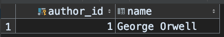
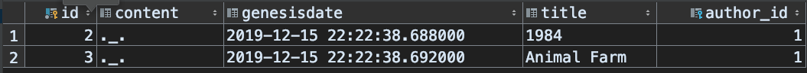

# 1. 연관 관계 매핑

연관 관계에는 크게 방향, 다중성이 존재한다.  
여기서 `방향`은 단방향, 양방향이 존재하고 `다중성`에는 일대일, 일대다, 다대일, 다대다가 있다.  

여기서는 연관 관계의 개념과 방향에 대해 정리한다.  


# 2. 연관 관계

JPA의 등장 배경은 객체와 릴레이션의 패러다임 차이를 극복하기 위함이다.  
테이블 중심으로 코드를 작성하면 객체 간 협력을 만들기 힘들다.(예: 협력하는 다른 객체의 참조가 아닌 키 값을 저장한다던가 하는 등)  

이건 이미 충분히 필요성을 느끼니 생략!

# 3. 방향

방향에는 단방향, 양방향이 있다.  
방향은 간단하게 말해 탐색 가능 여부이다. 한 쪽만 찾아갈 수 있으면 단방향, 양쪽 모두 서로를 찾을 수 있으면 양방향이다.  

## 3.1 단방향

다음과 같은 요구사항이 있다.  

- 저자(author)가 존재하고, 저자는 여러 포스트(post)를 쓸 수 있다.
- 포스트에는 저자가 기록된다.

이를 JPA로 작성해보자. 우선 저자(author)부터 만들자.  

```java
@Entity
@Table(name = "authors")
@Getter
@Setter
@ToString
public class Author {

    @Id
    @GeneratedValue
    @Column(name = "author_id")
    private Long id;

    private String name;
}
```

포스트를 보자.  

```java
@Entity
@Table(name = "posts")
@Getter
@Setter
@ToString
public class Post {

    @Id
    @GeneratedValue
    private Long id;

    private String title;

    private String content;

    @ManyToOne
    @JoinColumn(name = "author_id")
    private Author author;

    private Timestamp genesisDate = new Timestamp(System.currentTimeMillis());
}
```

그리고 이를 실행하는 코드는 다음과 같다.  
이 코드에서는 `연관관계를 저장`한다.

```java
Author author = new Author();
author.setName("George Orwell");
em.persist(author);

Post p1 = new Post();
p1.setTitle("1984");
p1.setContent("._.");
p1.setAuthor(author); // 단방향 연관관계 설정, 레퍼런스 저장
em.persist(p1);

Post p2 = new Post();
p2.setTitle("Animal Farm");
p2.setContent("._.");
p2.setAuthor(author); // 단방향 연관관계 설정, 레퍼런스 저장
em.persist(p2);

tx.commit();
```

이제 조회를 해보자.  

```java
final Post p1 = em.find(Post.class, 2L);
System.out.println(p1.getAuthor());
```

수정도 가능하다.  

```java
p1.setAuthor(anotherAuthor);
```

아주 간단하다.  

마지막으로 생성된 테이블을 살펴보자.  

author table  


post table


릴레이션의 경우에는 FK가 존재하면 `JOIN`을 이용해 양방향으로 찾아다닐 수 있다는 사실을 눈여겨 보자.  
하지만 객체의 경우에는??  

## 3.2 양방향 연관관계와 연관관계의 주인

앞서 살펴본 단방향에서는 Author 객체가 Post를 찾아갈 방법이 없었다.  
하지만 릴레이션의 관점에서는 FK를 이용하면 가능하다. 객체에서도 양방향으로 매핑을 하고 싶다면 어떻게 해야할까?  

우선 앞서 살펴본 코드를 수정해보자. 아! 참고로 앞선 데이터를 그대로 사용할 것이다. 따라서 테이블에는 변화가 없다.  

```java
@Entity
@Table(name = "posts")
@Getter
@Setter
@ToString
public class Post {

    @Id
    @GeneratedValue
    private Long id;

    private String title;

    private String content;

    @ManyToOne
    @JoinColumn(name = "author_id")
    private Author author;

    private Timestamp genesisDate = new Timestamp(System.currentTimeMillis());
}
```

포스트의 경우에는 코드에 변화가 없다. 이제 저자(author)를 보자.  
앞선 저자 객체에서는 포스트를 볼 방법이 없었다.  

```java
@Entity
@Table(name = "authors")
@Getter
@Setter
@ToString(exclude = "posts")
public class Author {

    @Id
    @GeneratedValue
    @Column(name = "author_id")
    private Long id;

    private String name;

    @OneToMany(mappedBy = "author")
    private List<Post> posts = new ArrayList<>();
}
```

이렇게 하면 다음과 같이 저자의 정보를 이용해 포스트를 모두 참조할 수 있다.  

```java
Author author = em.find(Author.class, 1L);
for (Post post : author.getPosts()) {
    System.out.println(post);
}
```

이로서 양방향으로 객체 그래프를 탐색할 수 있게 되었다..!  

여기서 눈여겨 봐야할 포인트는 다음 코드이다.  

```java
@OneToMany(mappedBy = "author")
private List<Post> posts = new ArrayList<>();
```

우선 Author와 Post의 관계를 생각해봤을 때, Author는 1에 해당하고, Post는 N에 해당한다.  
따라서 어노테이션이 `OneToMany`이다. 자신의 객체가 N인 경우는 Post객체에서 볼 수 있듯 `ManyToOne`이다.  

눈 여겨 볼 점은 객체는 양방향이 아니라 사실 서로를 향하는 단방향 두 개가 존재하는 것이다. 이와 반대로 테이블은 외래키 하나로 두 테이블의 연관 관계가 관리된다.  

여기서 혼란스러운 `mappedBy`가 있다. 여기서는 두 관계에서 연관관계의 주인을 지정한다.  

그렇다면 주인을 지정하는 기준은 무엇일까?  

- 주인은 둘 중 하나
- 외래키를 가진 쪽. 즉, 외래키를 다루는 쪽이 주인
- 주인이 아닌 쪽은 author와 같이 참조만 함
- 주인은 mappedBy 안씀. (Post 참고)
- 주인이 아닌쪽은 mappedBy로 주인 지정

앞서 보여준 실제 테이블에서 FK인 author_id를 가진 post가 연관관계의 주인인 것이다!  

이제 코드에서 주의할 점을 살펴보자.  

```java
Author author = new Author();
author.setName("hyeyoom");
em.persist(author);

Post post = new Post();
post.setTitle("Hello");
post.setContent("Bye");

author.getPosts().add(post);
post.setAuthor(author);

em.persist(post);
```

관계의 주인에 참조 값을 반드시 지정해주어야 한다. 또한 객체의 관점에서 양방향에서 참조하려면 반대의 경우에도 지정을 해주어야 한다.  

하지만 이는 코드를 누락할 가능성이 있으므로 참조를 저장하는 주인쪽에서 다음과 같이 해주어도 된다.  

```java
public void setAuthor(Author author) {
    this.author = author;
    author.getPosts().add(this);
}
```

이를 Convenience method라고 부른다. 순수 객체의 관점을 지키기 위한 친구이다!  

참고로 양방향 매핑의 경우 무한루프를 조심해야한다.  

## 3.3 양방향 요약

- 단방향으로도 릴레이션 관점의 연관 관계는 이미 설정되어 있음
- 양방향 매핑은 객체 그래프 탐색의 추가일 뿐
- 단방향부터 추가하고 필요 시 양방향을 추가함
- 외래키 있는 쪽이 주인, 반대쪽은 `mappedBy`로 주인 지정
- 객체의 관점을 지키기 위한 편의 메소드 추가하자

