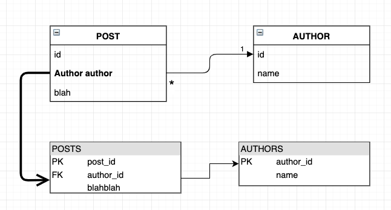
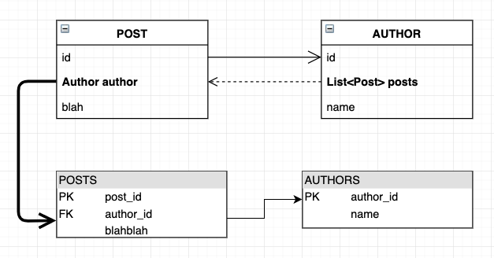
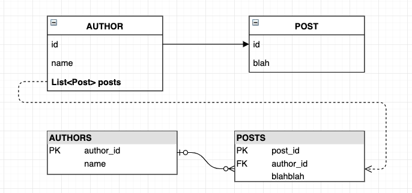

# 1. 다양한 연관 관계 매핑

연관관계 매핑에는 다음을 고려한다.  

- 다중성
- 방향성(단방향, 양방향)
- 연관관계의 주인

## 1.1. 다중성

1. 다대일: @ManyToOne
2. 일대다: @OneToMany
3. 일대일: @OneToOne
4. 다대다: @ManyToMany

## 1.2. 방향성

테이블 관점

- 외래키 하나로 양쪽 모두 조인 가능
- 방향 개념이 존재하지 않음

객체 관점

- 참조용 필드가 있어야 참조 가능
- 한 쪽만 참조하면 단방향
- 사실 양방향은 없음. 단방향이 두 개 존재할 뿐

## 1.3. 연관관계의 주인

- 테이블은 외래키 `단 하나`로 연관관계 맺기 가능
- 객체의 양방향은 단방향 참조가 두 개 존재
  - 이 참조가 두 개이기 때문에 외래키 관리의 주체를 정해야함
  - 외래키를 관리하는 주체가 연관관계의 주인
  - 주인이 아닌 쪽은 외래키에 영향을 주지 않고 조회만 함

하지만 사실 이건 묵시적 룰일 뿐이고 충분히 깨질 수 있어서 이해하고 주의해야함.  

# 2. 다대일(N:1)

가장 널리 사용되는 다대일 단방향을 정리해보자. (당연히 그 반대는 일대다)    


이는 단방향의 경우이다. 하지만 여전히 객체와는 별개로 테이블의 관점에서는 FK로 엮인 이상 양방향 관계이다.  

이제 양방향의 경우를 보자.  



`양방향`이 되는 순간 주인이 누구인지 명확히 하고 넘어가야 하는데, 외래키(FK)를 관리하는 쪽이 주인이다. 위 그림에서는 POST가 주인이 되는 셈.  

# 3. 일대다(1:N)



- 테이블은 방향만 다르고 내용은 같다는 사실을 알 수 있다. 하지만 여기서 이상한 점은 1에 해당하는 author가 `연관관계의 주인`이다.  
- 테이블 관점에서 일대다 관계는 항상 `다(N)`에 해당하는 부분에 외래키가 있다.  
- 이러한 특성 때문에 반대편 테이블의 외래키를 관리하는 상황이 온다.
  - 직관적으로 봤을 때, author를 조작하면 author만 업데이트가 되어야 할 것 같지만, 현실은 Post에서 발생한다.  
- 또한 함정이 있는데 `@JoinColumn`을 사용하지 않으면 조인테이블 방식으로 들어가기 때문에 association table이 생성된다.  

따라서 일대다 단방향보다는 `다대일 양방향 매핑을 추천`한다.  

일대다 양방향은 공식적으로는 불가능하지만 편법으로 가능하다. (그냥 다대일 양방향 써라.)  

- @JoinColumn(insertable=false, updatable=false)
- 읽기 전용 필드 사용

# 4. 일대일(1:1)

일대일은 별로 사용되진 않을 것 같지만.. 정리  

- 1:1에서 연관관계의 주인은?
  - 알아서 눈치껏(미래에 N이 될 가능성이 높은 엔티티에게)
- 외래키에 유니크 제약이 추가됨

일대일 단방향은 다대일 단방향과 유사하다. 코드로 간단히 살펴보자.  

우선 관계의 주인인 author 객체를 보자.  

```java
@Entity
@Table(name = "authors")
@Getter
@Setter
public class Author {

    @Id
    @GeneratedValue
    @Column(name = "author_id")
    private Long id;

    private String name;

    @OneToOne
    @JoinColumn(name = "profile_id")
    private Profile profile;
}
```

그리고 프로파일.  

```java
@Entity
@Table(name = "profiles")
@Getter
@Setter
public class Profile {

    @Id @GeneratedValue
    private Long id;

    private String bio;
}
```

코드 사용.  

```java
Profile profile = new Profile();
profile.setBio("The Greatest Man Ever");
em.persist(profile);

Author author = new Author();
author.setName("George Orwell");
author.setProfile(profile);
em.persist(author);

tx.commit();
```

다대일 단방향 매핑과 어노테이션 이름만 다르고 거의 같다.  
그렇다면 일대일 양방향도 감이 올 것이다. 프로파일을 다음과 같이 변경하자.  

```java
@Entity
@Table(name = "profiles")
@Getter
@Setter
public class Profile {

    @Id @GeneratedValue
    private Long id;

    private String bio;

    @OneToOne(mappedBy = "profile")
    private Author author;
}
```

관계의 주인이 아닌 쪽이기 때문에 `mappedBy`를 걸어주었다.  

정리

주 테이블에 외래키 있는 경우:

- 객체지향적
- 매핑 편리
- pros: 주 테이블만 조회해도 존재 여부 체크 가능
- cons: 값이 없으면 FK가 nullable

대상 테이블에 외래키:

- 대상 테이블에 외래키 
- DBA 관점에서 좋음
- 관계 변경시 테이블 구조 유지 가능
- 프록시의 한계로 지연로딩으로 설정해도 로딩됨

# 5. 다대다(N:M)

테이블 관점에서 정규화 된 두 테이블로 다대다를 표현할 수 없다.  
따라서 연관 테이블을 만들어서 다대일 관계 두 개를 만들어서 표현해야한다.  

이를 위해

- @ManyToMany 사용
- @JoinTable로 연결 테이블 지정

을 하면 된다. 코드를 보자.  

우선 멤버 엔티티.  

```java
@Entity
@Setter
@Getter
@Table(name = "members")
public class Member {

    @Id
    @GeneratedValue
    private Long id;

    private String memberName;

    @ManyToMany(fetch = FetchType.LAZY, cascade = CascadeType.ALL)
    @JoinTable(
            name = "member_product",
            joinColumns = @JoinColumn(name = "member_id"),
            inverseJoinColumns = @JoinColumn(name = "product_id")
    )
    private List<Product> products = new ArrayList<>();
}
```

프로덕트 엔티티.

```java
@Entity
@Setter
@Getter
@Table(name = "products")
public class Product {

    @Id @GeneratedValue
    private Long id;

    private String productName;

    @ManyToMany(fetch = FetchType.LAZY, cascade = CascadeType.ALL)
    @JoinTable(
            name = "member_product",
            joinColumns = @JoinColumn(name = "product_id"),
            inverseJoinColumns = @JoinColumn(name = "member_id")
    )
    private List<Member> members = new ArrayList<>();
}
```

뭐 사용 방법은 예상대로..  

## 5.1. 다대다 매핑의 한계점

- 실무에서 쓸 일이 없음
  - 실제로 매핑만 저장하는 테이블을 잘 안씀
  - 부가적인 데이터가 들어갈 필요가 생김

따라서 다대다 매핑을 연결 테이블을 위한 엔티티로 사용한다.  

## 5.2. 다대다 매핑 엔티티

메핑 테이블이 아닌 다대다 조인을 위한 연결 정보 엔티티로 수정해보자.  

우선 멤버 엔티티.  

```java
@Entity
@Setter
@Getter
@Table(name = "members")
public class Member {

    @Id
    @GeneratedValue
    private Long id;

    private String memberName;

    @OneToMany(mappedBy = "member")
    private List<MemberProduct> memberProducts = new ArrayList<>();
}
```

그리고 프로덕트 엔티티.

```java
@Entity
@Setter
@Getter
@Table(name = "products")
public class Product {

    @Id @GeneratedValue
    private Long id;

    private String productName;

    @OneToMany(mappedBy = "product")
    private List<MemberProduct> memberProducts = new ArrayList<>();
}
```

그리고 멤버-프로덕트 엔티티. 사실은 이름을 바꾸면 더 좋지만..  

```java
@Entity
@Setter
@Getter
@Table(name = "member_product")
public class MemberProduct {

    @Id @GeneratedValue
    private Long id;

    @ManyToOne
    @JoinColumn(name = "member_id")
    private Member member;

    @ManyToOne
    @JoinColumn(name = "product_id")
    private Product product;
}
```

그리고 사용해보자.  

```java
Member member = new Member();
member.setMemberName("hyeyoom");
em.persist(member);

Product p1 = new Product();
p1.setProductName("p1");
em.persist(p1);

Product p2 = new Product();
p2.setProductName("p2");
em.persist(p2);

Product p3 = new Product();
p3.setProductName("p3");
em.persist(p3);

MemberProduct mp1 = new MemberProduct();
mp1.setMember(member);
mp1.setProduct(p1);
em.persist(mp1);

MemberProduct mp2 = new MemberProduct();
mp2.setMember(member);
mp2.setProduct(p2);
em.persist(mp2);

MemberProduct mp3 = new MemberProduct();
mp3.setMember(member);
mp3.setProduct(p3);
em.persist(mp3);

tx.commit();
```

으아..  