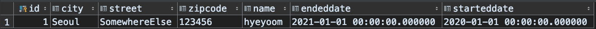
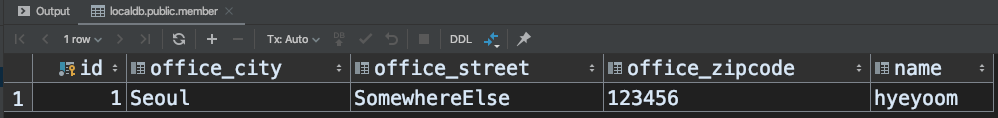
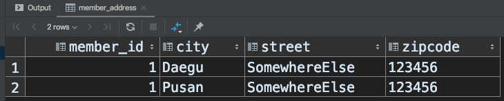

# 1. 기본값 타입

JPA에는 두 가지 데이터 타입이 있다.  

- 엔티티 타입
- 값 타입

DDD의 entity와 value object를 떠올리면 아주 간단하다. 도메인 주도 개발에서 엔티티는 식별 가능한 객체를 의미하고, 값 객체(vo)는 그저 값인데다가 불변인 객체를 의미한다.  

JPA에서의 엔티티와 값 타입도 이와 상당히 유사하다.  

(1) 엔티티 타입

- @Entity로 정의함
- 데이터가 변경되어도 식별할 수 있음 (식별자 @Id)

(2) 값 타입

- int, Integer, String 과 같은 primitive type이나 래핑 타입들
- 식별자가 없으므로 변경 시 추적이 불가능

그렇다면 값 타입에 대해 정리해보자.  

## 1.1. 값 타입의 종류

1. 기본값 타입
   1. primitive
   2. wrapper class(primitive)
   3. String
2. 임베디드 타입(embedded type)
3. 컬렉션 타입

# 2. 기본값 타입

흔히 알고 있는 원시타입이나 그것을 래핑한 클래스를 말한다. String은 엄밀히 primitive는 아니지만 기본 값 타입이다.  

그리고 사용해봐서 알겠지만 생명주기가 엔티티와 공유된다.  

값 타입의 특징은 원시타입의 특징과 똑같다. 항상 값을 복사하기 때문에 참조가 아니고, 변경 시 다른 곳에 영향을 주지 않는다. 래퍼클래스나 String도 물론 공유는 가능하지만 변경에 대해 영항을 주지 않는다.  

# 3. 임베디드 타입(복합 타입)

복합적인 여러 값을 가진 객체로 타입을 표현할 수 있다. 쉽게 말하면 사용자 정의 타입이다. 거창한 이름을 가져서 그렇지 현실은 그냥 클래스를 정의해서 그걸 사용할 수 있다는 뜻이다.  

예를들어 주소나 근태 정보 같은 객체를 따로 뽑아두면 생기는 장점을 생각해보자.  

- 재사용 (당연하다)
- 해당 타입에만 존재하는 의미 있는 메소드 생성 가능
  - 즉, 높은 응집도를 취할 수 있음

뭐 일단 써보자. 우선 임베디드 타입을 사용하고 있는 멤버부터!

```java
@Entity
@Getter
@Setter
@ToString
public class Member {

    @Id @GeneratedValue
    private Long id;

    private String name;

    @Embedded
    private Period workingPeriod;

    @Embedded
    private Address homeAddress;
}
```

그리고 각각의 임베디드 타입을 보자.  

```java
@Getter
@ToString
@Embeddable
@NoArgsConstructor
@AllArgsConstructor
public class Address {

    private String city;

    private String street;

    private String zipCode;
}

@Getter
@ToString
@Embeddable
@NoArgsConstructor
@AllArgsConstructor
public class Period {

    private LocalDateTime startedDate;

    private LocalDateTime endedDate;
}
```

간단하다. 저장/조회 방법은 이전과 동일하니 생략!  
테이블을 보면 다음과 같이 저장되어 있는 모습을 확인할 수 있다.  



임베디드 타입에 필요한 어노테이션을 정리해보자.  

|annotation|description|
|-|-|
|@Embeddable|값 타입 정의하는 곳(TYPE)|
|@Embedded|값 타입을 사용하는 곳(FIELD)|

참고로 기본 생성자가 필수이다. 따라서 롬복을 사용하는 경우라면 `@NoArgsConstructor`를 꼭 붙여주자.  

아 또 덧붙이면 임베디드 타입이 null로 들어가면 칼럼도 null이 들어간다!  

## 3.1. 장점

앞서 설명했지만 정리해보자.  

- 재사용
- 높은 응집도
- 해당 복합 값에만 있는 특수한 메소드 정의 가능
- 값 타입이기 때문에 엔티티의 생명 주기에 의존

## 3.2. 재정의

한 엔티티에서 동일한 임베디드 타입을 사용하거나 속성 이름을 재정의 하고 싶은 경우 사용하는 어노테이션에 대해 정리해보자.  

|annotation|description|
|-|-|
|@AttributeOverrides|재정의할 타입 지정|
|@AttributeOverride|재정의할 필드 지정|

임베디드 타입을 사용하는 곳에서 재정의해주면 된다.  

```java
@Entity
@Getter
@Setter
@ToString
public class Member {

    @Id
    @GeneratedValue
    private Long id;

    private String name;

    @Embedded
    private Period workingPeriod;

    @Embedded
    @AttributeOverrides({
            @AttributeOverride(name = "city", column = @Column(name = "OFFICE_CITY")),
            @AttributeOverride(name = "street", column = @Column(name = "OFFICE_STREET")),
            @AttributeOverride(name = "zipCode", column = @Column(name = "OFFICE_ZIPCODE"))
    })
    private Address homeAddress;
}
```

으.. 요즘 코틀린에 익숙해져있어서 `외않데` 존나 외쳤다.. 이것은 자바입니다.  

# 4. 값 타입과 불변객체

앞서 소개한 값 타입들은 객체 선언의 편의성 제공을 위해 탄생한 친구들이다. 하지만 무서운 함정이 존재한다.  

## 4.1. 값 타입 공유 참조

임베디드 타입을 여러 곳에서 공유하면 위험하다. 하나의 값 타입(특히 임베디드)을 공유하는 두 엔티티가 있다고 가정해보자.  

그 하나의 값 타입이 수정되면 두 곳 모두에 영향을 끼친다. 사이드 이펙트가 일어날 가능성이 있다는 뜻이다..!  

따라서 값 타입을 사용할 땐 참조를 공유하는 것이 아니라 값만 복사해서 새 인스턴스를 만들어서 제공해야한다.  

## 4.2. 객체 타입의 한계

- 객체 타입은 참조 공유를 막을 수 없음

이 하나 덕분에 부작용이 생긴다. 따라서 JPA의 값 타입은 DDD의 VO처럼 불변성을 보장해주어야 한다.  

## 4.3. 불변성

생성 이후로 값이 변하지 않는 것이 불변 객체이다. 따라서 `Setter`를 제거하면 된다. Setter를 습관적으로 다는 것을 지양해야한다.  

- 그렇다고 참조 공유를 막을 수는 없잖아?!
  - 적어도 값이 변경되지 않기 때문에 참조한 부분만 찾으면 되기 때문에 에러 추적 쉬워짐

# 5. 값 타입 비교

원시타입의 값 비교를 생각해보자.  

```java
int a = 10;
int b = 10;

System.out.println(a == b);   // true or false?
```

결과는 당연히 `true`이다.  

하지만 값 타입(특히 임베디드 타입)은 인스턴스이기 때문에 동등 비교 연산 `==`을 사용하면 아무리 값이 같아도 서로 다르게 평가된다. 이는 값 타입이라는 본분을 벗어나는 동작이다.  

따라서 값 타입은 equals 메소드를 오버라이드 해줄 필요가 있다.  
롬복 사용자라면 `@EqualsAndHashCode`를 사용하면 간단하게 끝난다.  

그 후에 다음과 같이 비교를 해보자.  

```java
System.out.println(addr1.equals(addr2));
```

# 6. 값 타입 컬렉션

컬렉션인 값 타입은 어떻게 해야할까? 물론 관계를 지정해 다대일로 매핑한 엔티티를 만들어도 되겠지만 여기서는 값 타입 파트니까..  

- 값 타입을 두 개 이상 저장할 때 필요
- 컬렉션은 같은 테이블에 당연히 저장 불가능
  - 따라서 별도 테이블이 필요함(이럴거면 엔티티를 읍읍)

여기에 필요한 어노테이션에 대해 정리해보자.  

|annotation|description|
|-|-|
|@ElementCollection|기본 타입이나 embeddable 클래스의 인스턴스 컬렉션 명시|
|@CollectionTable|실제로 컬렉션이 저장될 테이블 지정|

간단하다. 이제 코드로 보자!

```java
@Entity
@Getter
@Setter
@ToString
public class Member {

    @Id
    @GeneratedValue
    private Long id;

    private String name;

    @Embedded
    @AttributeOverrides({
            @AttributeOverride(name = "city", column = @Column(name = "OFFICE_CITY")),
            @AttributeOverride(name = "street", column = @Column(name = "OFFICE_STREET")),
            @AttributeOverride(name = "zipCode", column = @Column(name = "OFFICE_ZIPCODE"))
    })
    private Address homeAddress;

    @ElementCollection
    @CollectionTable(
            name = "MEMBER_ADDRESS",
            joinColumns = @JoinColumn(name = "MEMBER_ID")
    )
    private List<Address> addresses;
}
```

joinColumns를 딱히 안걸어도 상관은 없지만..  
저번에 사용했던 클래스지만 흐름을 위해.. Address 클래스

```java
@Getter
@ToString
@Embeddable
@NoArgsConstructor
@AllArgsConstructor
@EqualsAndHashCode
public class Address {

    private String city;

    private String street;

    private String zipCode;
}
```

사용 방법은 동일하다.  

```java
Address addr = new Address("Seoul", "SomewhereElse", "123456");
Member member = new Member();
member.setName("hyeyoom");
member.setHomeAddress(addr);
Address addr1 = new Address("Daegu", "SomewhereElse", "123456");
Address addr2 = new Address("Pusan", "SomewhereElse", "123456");
List<Address> addressList = new ArrayList<>();
addressList.add(addr1);
addressList.add(addr2);
member.setAddresses(addressList);

em.persist(member);
```

테이블에 어떻게 영속화 되는지 보자!




## 6.1. 사용 예제

저장은 이미 앞에서 보였고 조회(기본 LAZY), 수정을 살펴 보자.  


### 6.1.1. 값 타입 컬렉션 조회

우선 조회를 해보자.  

```java
Member foundMember = em.find(Member.class, member.getId());
```

조회는 간단하다. 결과는 다음과 같다.  

```text
Hibernate: 
    select
        member0_.id as id1_0_0_,
        member0_.OFFICE_CITY as OFFICE_C2_0_0_,
        member0_.OFFICE_STREET as OFFICE_S3_0_0_,
        member0_.OFFICE_ZIPCODE as OFFICE_Z4_0_0_,
        member0_.name as name5_0_0_ 
    from
        Member member0_ 
    where
        member0_.id=?
```

값 타입 컬렉션은 기본 전략이 LAZY이기 때문에 쿼리가 나가지 않았다.  
물론 사용을 하면 읽어오는 것도 확인할 수 있다.  

```java
foundMember.getAddresses();
```

결과를 보자.  

```text
Hibernate: 
    select
        addresses0_.Member_id as Member_i1_1_0_,
        addresses0_.city as city2_1_0_,
        addresses0_.street as street3_1_0_,
        addresses0_.zipCode as zipCode4_1_0_ 
    from
        MEMBER_ADDRESS addresses0_ 
    where
        addresses0_.Member_id=?
```

잘 읽어온다.  

### 6.1.2. 값 타입 컬렉션 수정

우선 삭제를 해보겠다.  

```java
addressList.remove(new Address("Pusan", "SomewhereElse", "123456"));
foundMember.setAddresses(addressList);
```

결과를 예상해보자.  

```java
Hibernate: 
    /* delete collection com.github.hyeyoom.studynote.jpa.jpashop.entities.Member.addresses */ delete 
        from
            MEMBER_ADDRESS 
        where
            Member_id=?
Hibernate: 
    /* insert collection
        row com.github.hyeyoom.studynote.jpa.jpashop.entities.Member.addresses */ insert 
        into
            MEMBER_ADDRESS
            (Member_id, city, street, zipCode) 
        values
            (?, ?, ?, ?)
```

삭제가 발생하고 저장이 발생했다. 왜???  
삭제 시 나간 쿼리를 보자. 다 지운다. 왜???
칼럼을 특정할 방법(은 물론 있지만)이 없어서이다.  

물론 해결 방법은 있다. `@OrderColumn`같이 레코드를 특정할 순서를 나타내는 칼럼을 추가하는 방법이다. 이럴거면 엔티티 쓰는게 낫다.  

수정도 마찬가지지만 해보자.  

```java
Address foundAddress = foundMember.getAddresses().get(0);
foundAddress.setCity("hiyo");
foundMember.setAddresses(addressList);
```

이 방법은 보면 알겠지만 시작부터 안좋다. 값 타입은 immutable을 지향해야 하는데 setter를 썼다.  

그리고 당연히 결과는 볼 필요도 없이 삭제 1회, 저장 2회가 나갔다.  

## 6.2. 값 타입 컬렉션의 제약사항

- 식별자 없음 (값 타입. VO!)
- 값 변경에 대한 추적이 어려움
- 변경에 대해 다시 저장하는 일이 발생

따라서 일대다 관계를 쓰고 엔티티로 승격해서 사용하는 것이 낫다.  
관계를 위한 엔티티를 만들고 값 타입을 엔티티에서 사용하는 구조로 가면 된다. 또한 값 타입처럼 사용하기 위해 영속성 전이 ALL에 고아 제거를 사용하면 이 점을 보완할 수 있다.  

# 7. 결론

엔티티 타입

- 식별자 존재
- 생명 주기 관리
- 공유

값 타입

- 식별자 없음
- 생명 주기는 엔티티에 의존
- immutable