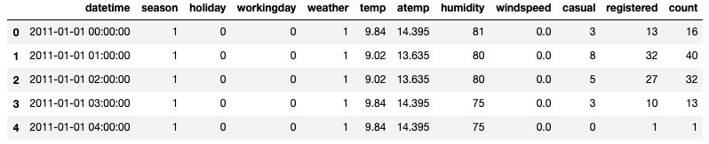
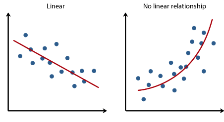
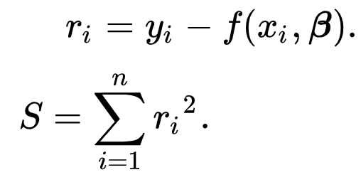
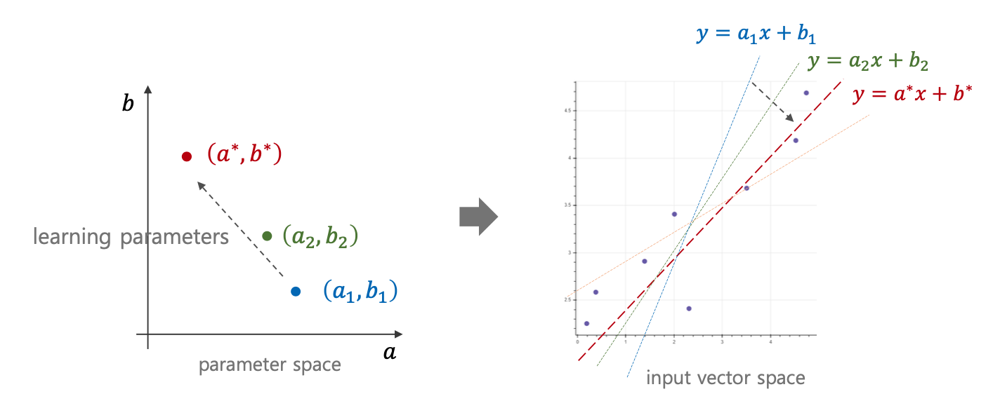
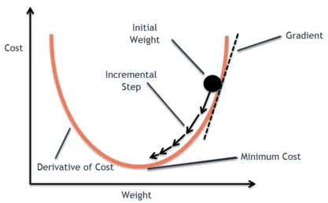
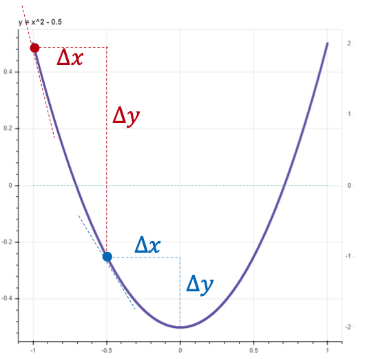
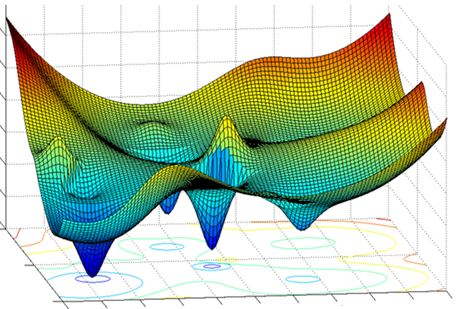

# intro.

2019년 12월 21일 10시 너무 추움. 하지만 이제 피부가 안터서 괜찮음.  

오늘은 Linear Regression의 기초에 대해 다룬다.  

# 1. Vector

열벡터, 행벡터 할 때 그 벡터.  



그림과 같이 하나의 `row(data, record 등)`는 여러 변수(column, variable, feature 등)로 구성되어 있다.  

위 그림과 같이 숫자 데이터는 벡터로 바로 표현할 수 있다.  

```text
[1, 0, 0, 1, 9.84, 14.395, 81, 0.0, 3, 13, 16]
```

명목형 변수(categorical data)가 포함되면 벡터로 표현할 수 있도록 이를 인코딩 해주어야 한다. (One-Hot encoding 같은)  

머신러닝에서 무언가 학습한다는 것은 위와 같은 변수를 두고 이를 예측할 수 있는 함수를 만드는 것과 같다.  

# 2. Regression

`Regression`은 입력 변수(input variable)를 이용해 출력 변수(numerical output variable)의 값을 예측하는 문제이다.  

앞서 보인 테이블은 자전거 대여를 한 당시의 데이터 값을 보여준다. 그리고 이 결과인 대여 수요를 주어 학습시켜서 이 변수들에 따른 대여 수요를 예측할 수 있는 함수를 찾는 것이라고 볼 수 있다!  

`Regression`은 추세선의 종류에 따라 선형/비선형으로 나뉜다.  
선형은 직관적으로 x의 범위와 상관 없이 관계식이 일정하다는 가정이 필요하다.  



## 2.1 Univariate Linear Regression

두 변수 x와 y 사이에 `y = ax + b`라는 관계가 있다고 가정한다.  
그리고 데이터 셋을 긋는 선들 중 가장 잘 맞는 선을 선택한다.  
이 선을 회귀선이라고 부른다. 이 회귀선을 선택하는 기준이 존재한다.  

# 3. Least Squares(최소제곱법)

회귀선을 선택하는 기준에 대해 알아보자.  

여기서 `잔차(residual)`라는 용어가 등장하는데, 회귀선의 예측이 틀린 정도로 정의된다. 잔차는 음수가 될 수 있기 때문에 이 잔차들을 제곱한 합이 최소가 되는 직선이 가장 잘 설명하는 모델이 된다.  

이 틀린 정도를 나타내는 척도를 `Loss`라고 부르며 다음과 같이 나타낸다.  



여러 선(회귀선)들 중 loss가 가장 적은 친구를 택하는 것이다. 이를 목적식(objective)이라고 한다.  

잔차 제곱의 합으로 정의되기 때문에 목적식은 `y = ax + b`에서 a, b에 대한 `2차 함수`이다. 이 모델을 설명하는 변수 a, b를 잘 조절하여 loss가 가장 적은 선을 찾는 과정이며, 이 두 변수를 파라미터라고 한다.  

수식으로 결정되는 최적해를 탐색하는 과정은 loss를 나타내는 식이 2차 함수일 때에는 잘 동작한다. 하지만 이를 넘어가는 함수는 풀 수 없다는 단점이 존재한다. (즉, 대수적인 해법으로 해를 결정할 수 없는 함수) 

이런 경우에는 경험적(empirically)으로 최적해를 탐색하는 방법이 존재한다.  

# 4. Gradient Descent

`경사하강법(Gradient Descent)`은 현재의 직선보다 잔차의 제곱 합이 더 작은 직선으로 loss를 줄여나가며 최저점을 찾는 방법이다.   



파라미터 공간에서 학습 파라미터를 조절하여 입력 벡터 공간의 직선을 조정한다.  

앞서 소개한 회귀선의 목적식은 다음과 같은 `2차 함수`이다.



다음 그림을 보자.  



여기서 최저점을 찾기 위해 y의 변위를 x의 변위로 나눈 값을 바탕으로 탐색한다. 최저점에 가까울 수록 이 값은 0에 가깝다.  

최저점을 지나치면 이 값이 양수가 된다.  
경사하강법은 y가 줄어드는 방향으로 x를 이동시켜 y의 최저점을 탐색한다.  

x는 -(dy/dx)에 작은 값(learning rate)를 곱한 값만큼 이동시킨다.  

이 Learning Rate가 커지면 `Gradient Explosion`이 발생하며 발산하는 현상이 발생할 수도 있다. 이러한 이유로 learning rate의 값은 작은 수를 사용한다.  

다만 explosion을 막기 위해 작은 learning rate를 사용하면 최저점까지 이동하기 위한 스텝의 수가 많아진다.  

따라서 `AdaGrad(Adaptive Gradient)` 같은 방법을 사용한다. 이 방법은 이전 변위에 현재 변위를 누적하여 방향이 동일하면 이동량을 가속하고, 방향이 바뀌면 누적 값을 줄여 감속시켜 진동하다가 수렴하는 형태가 된다.  

여기서는 `2차 함수`였기 때문에 `local minima` 같은 현상이 발생하지 않겠지만 함수가 복잡해지면, 즉 차수가 높아지면 global minima와 local minima 여러 개가 존재하게 된다.  



이런 경사하강법 기반의 파라미터 학습에는 여러 전략이 존재한다.  

- Adam
- AdaGrad
- RMSProp

이런 것들을 `optimizer`라고 부른다. `Local Optima`를 회피하며 최저점을 효율적으로 찾기 위한 도구들이다.  

경사하강법 결론:

- 대수적으로 해를 결정할 수 없는 복잡한 함수에도 쓸 수 있음
- 모델 품질 결정 기준(loss function)이 주어지면 품질이 좋은 파라미터를 찾아나가기 위해 파라미터를 수정하는 `경험적 탐색법`

# 5. 회귀선 품질 결정을 위한 여러 방법

회귀선 품질 결정을 위한 방법은 하나만 존재하지 않는다. 앞서 소개한 방법은 단순한 2차 함수였지만, 확률분포를 사용할 수도 있고 로그를 사용할 수도 있다.  

## 5.1. Maximum Likelihood Estimation(MLE)

이는 회귀선 품질 정도를 `확률분포`로 표현하는 방법이다.  

## 1.1 Least Square props & cons

cons: 수식적으로 풀 수 없거나 난해한 경우, 경험적으로 찾는 것도 가능 -> 뉴럴넷

## 1.2. Gradient Descent

parameter를 미분에 기반하여 찾음(sign of loss)

gd -> trial and error

최소제곱법을 쓰는 이유? 제곱을 하면 에러의 폭이 큰데, 에러의 폭이 커지면 하강을 더 많이 할 지 적게 할 지 결정하기 쉬움.

learning rate가 작으면 학습 속도가 느려짐, 그러나 커지면 explosion 발생할 가능성이 높음
-> 그런 이유로 충분히 작은 값들을 사용함.
(최저점 지나갈 가능성 존재)

## 1.2.1 adaptive gradient descent

naive한 방법이 아닌 이전의 변위를 합산해 하강 rate를 결정해 찾아가는 방법

## 1.2.2 결론

결정해를 도출 할 수 없는(비선형 미분 방정식 같은) 식을 경험적으로 찾기 위한 방법

- mini ei^2 => 학습 품질
- 학습법 (LS, GD)

# 2. MLE(Maximum Likelihood Estimation)

# 3. NLL

a, b와 연관 관계가 없기 때문에, 한 axis를 고정하고 각각의 optima를 구하는 것들이 이 방법들임.

하지만 a와 b가 관계가 있는, ab같은 것이 bilinear라고 말함.  

# 4. Loss, regularization cost

Loss: 식을 잘 맞췄냐
Regularization cost: 

fat data: 변수가 data보다 많음

Evaluation: table 오탈자 존재

# Why we use RMSE loss instead MAP

MAP은 절대값이라 최저점 근처에서 속도 저하가 없음

