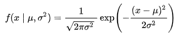
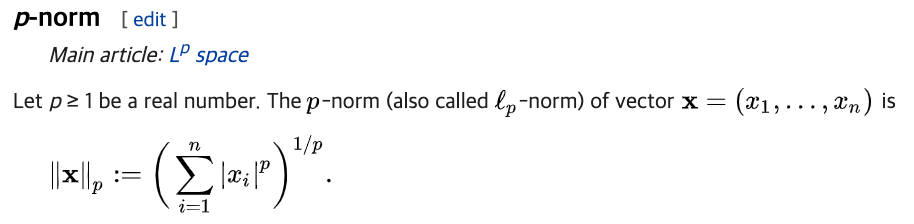
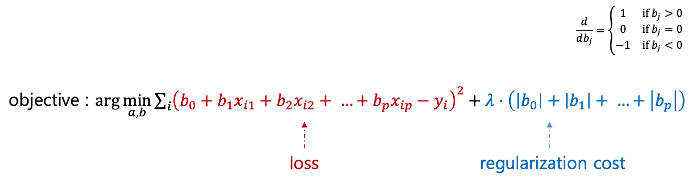
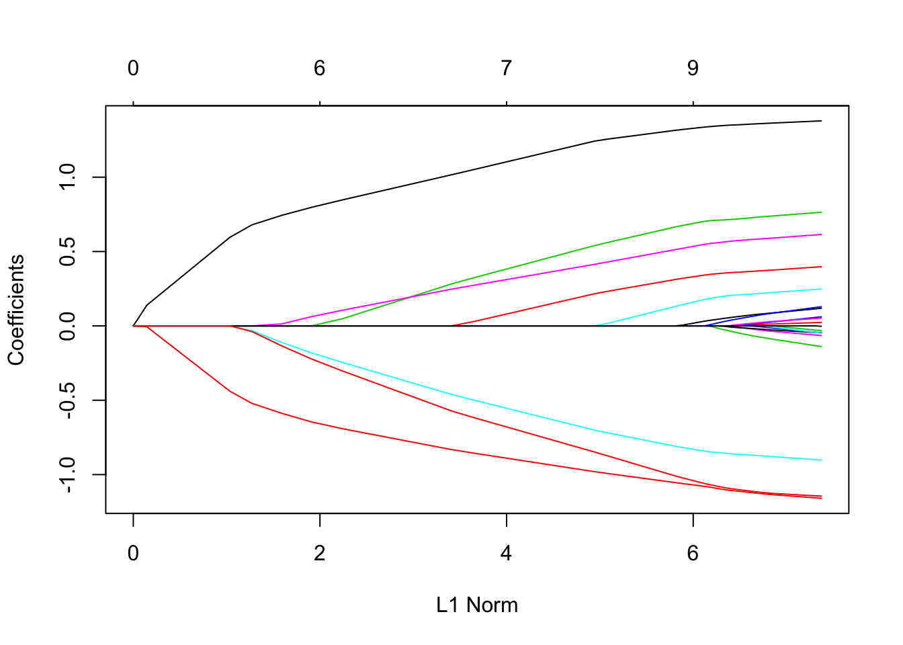
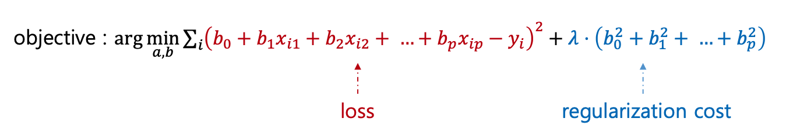
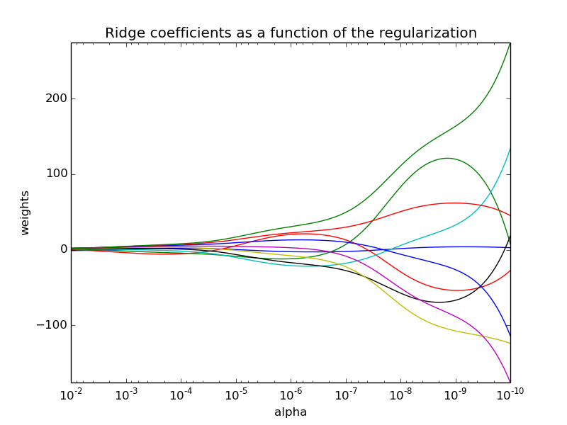

# intro.

2019년 12월 21일 10시 너무 추움. 하지만 이제 피부가 안터서 괜찮음.  

오늘은 Linear Regression의 기초에 대해 다룬다.  

# 1. Vector

열벡터, 행벡터 할 때 그 벡터.  


그림과 같이 하나의 `row(data, record 등)`는 여러 변수(column, variable, feature 등)로 구성되어 있다.  

위 그림과 같이 숫자 데이터는 벡터로 바로 표현할 수 있다.  

```text
[1, 0, 0, 1, 9.84, 14.395, 81, 0.0, 3, 13, 16]
```

명목형 변수(categorical data)가 포함되면 벡터로 표현할 수 있도록 이를 인코딩 해주어야 한다. (One-Hot encoding 같은)  

머신러닝에서 무언가 학습한다는 것은 위와 같은 변수를 두고 이를 예측할 수 있는 함수를 만드는 것과 같다.  

# 2. Regression

`Regression`은 입력 변수(input variable)를 이용해 출력 변수(numerical output variable)의 값을 예측하는 문제이다.  

앞서 보인 테이블은 자전거 대여를 한 당시의 데이터 값을 보여준다. 그리고 이 결과인 대여 수요를 주어 학습시켜서 이 변수들에 따른 대여 수요를 예측할 수 있는 함수를 찾는 것이라고 볼 수 있다!  

`Regression`은 추세선의 종류에 따라 선형/비선형으로 나뉜다.  
선형은 직관적으로 x의 범위와 상관 없이 관계식이 일정하다는 가정이 필요하다.  


## 2.1 Univariate Linear Regression

두 변수 x와 y 사이에 `y = ax + b`라는 관계가 있다고 가정한다.  
그리고 데이터 셋을 긋는 선들 중 가장 잘 맞는 선을 선택한다.  
이 선을 회귀선이라고 부른다. 이 회귀선을 선택하는 기준이 존재한다.  

# 3. Least Squares(최소제곱법)

회귀선을 선택하는 기준에 대해 알아보자.  

여기서 `잔차(residual)`라는 용어가 등장하는데, 회귀선의 예측이 틀린 정도로 정의된다. 잔차는 음수가 될 수 있기 때문에 이 잔차들을 제곱한 합이 최소가 되는 직선이 가장 잘 설명하는 모델이 된다.  

이 틀린 정도를 나타내는 척도를 `Loss`라고 부르며 다음과 같이 나타낸다.  


여러 선(회귀선)들 중 loss가 가장 적은 친구를 택하는 것이다. 이를 목적식(objective)이라고 한다.  

잔차 제곱의 합으로 정의되기 때문에 목적식은 `y = ax + b`에서 a, b에 대한 `2차 함수`이다. 이 모델을 설명하는 변수 a, b를 잘 조절하여 loss가 가장 적은 선을 찾는 과정이며, 이 두 변수를 파라미터라고 한다.  

수식으로 결정되는 최적해를 탐색하는 과정은 loss를 나타내는 식이 2차 함수일 때에는 잘 동작한다. 하지만 이를 넘어가는 함수는 풀 수 없다는 단점이 존재한다. (즉, 대수적인 해법으로 해를 결정할 수 없는 함수) 

이런 경우에는 경험적(empirically)으로 최적해를 탐색하는 방법이 존재한다.  

# 4. Gradient Descent

`경사하강법(Gradient Descent)`은 현재의 직선보다 잔차의 제곱 합이 더 작은 직선으로 loss를 줄여나가며 최저점을 찾는 방법이다.   


파라미터 공간에서 학습 파라미터를 조절하여 입력 벡터 공간의 직선을 조정한다.  

앞서 소개한 회귀선의 목적식은 다음과 같은 `2차 함수`이다.


다음 그림을 보자.  


여기서 최저점을 찾기 위해 y의 변위를 x의 변위로 나눈 값을 바탕으로 탐색한다. 최저점에 가까울 수록 이 값은 0에 가깝다.  

최저점을 지나치면 이 값이 양수가 된다.  
경사하강법은 y가 줄어드는 방향으로 x를 이동시켜 y의 최저점을 탐색한다.  

x는 -(dy/dx)에 작은 값(learning rate)를 곱한 값만큼 이동시킨다.  

이 Learning Rate가 커지면 `Gradient Explosion`이 발생하며 발산하는 현상이 발생할 수도 있다. 이러한 이유로 learning rate의 값은 작은 수를 사용한다.  

다만 explosion을 막기 위해 작은 learning rate를 사용하면 최저점까지 이동하기 위한 스텝의 수가 많아진다.  

따라서 `AdaGrad(Adaptive Gradient)` 같은 방법을 사용한다. 이 방법은 이전 변위에 현재 변위를 누적하여 방향이 동일하면 이동량을 가속하고, 방향이 바뀌면 누적 값을 줄여 감속시켜 진동하다가 수렴하는 형태가 된다.  

여기서는 `2차 함수`였기 때문에 `local minima` 같은 현상이 발생하지 않겠지만 함수가 복잡해지면, 즉 차수가 높아지면 global minima와 local minima 여러 개가 존재하게 된다.  


이런 경사하강법 기반의 파라미터 학습에는 여러 전략이 존재한다.  

- Adam
- AdaGrad
- RMSProp

이런 것들을 `optimizer`라고 부른다. `Local Optima`를 회피하며 최저점을 효율적으로 찾기 위한 도구들이다.  

경사하강법 결론:

- 대수적으로 해를 결정할 수 없는 복잡한 함수에도 쓸 수 있음
- 모델 품질 결정 기준(loss function)이 주어지면 품질이 좋은 파라미터를 찾아나가기 위해 파라미터를 수정하는 `경험적 탐색법`

# 5. 회귀선 품질 결정을 위한 여러 방법

회귀선 품질 결정을 위한 방법은 하나만 존재하지 않는다. 앞서 소개한 방법은 단순한 2차 함수였지만, 확률분포를 사용할 수도 있고 로그를 사용할 수도 있다.  

## 5.1. Maximum Likelihood Estimation(MLE)

이는 회귀선 품질 정도를 `확률분포`로 표현하는 방법이다.  

- 잔차의 크기가 작을 수록 확률이 높은 확률식을 정의
- 정규분포를 따른다고 가정

이 때 `확률분포함수`는 다음과 같다.  



이 Likelihood 중 가장 큰 녀석이 품질 좋은 모델이 될 것이다.  
MLE는 확률을 최대화 하는 파라미터를 찾는 과정이 된다.  

- 잔차가 작을 수록 확률이 높음
- 이것도 경사하강법으로 탐색

## 5.2. Negative Log Likelihood

로그는 단조 증가 함수이다. 이를 이용한 것이다.  
함수 f(x)의 최저점은 log(f(x))의 최저점과 위치가 같다. 로그함수는 경사하강법 적용에 유리하다. (단조 증가)  

또한 잔차 확률이나 최소제곱법으로 정의한 회귀선 품질 기준이 동일하다.  

이 방법은 임의의 확률 기반의 loss에 이용할 수 있으며, NLL에서의 loss는 확률이 작을 수록 loss가 크다.  

# 6. Regularization

과적합(overfitting) 문제를 해결하는 방법은 대표적으로 다음과 같은 것들이 있다.  

- 훈련 데이터 양을 늘린다 -> 시간, 비용 많이 듬
- feature 제거 -> model selection, 종속 변수와 연관이 낮은 feature 제거
- Regularization

여기서는 regularization을 정리함.  

p-norm은 다음과 같이 정의된다.  



* `p = 0`이면 0이 아닌 차원의 개수이고,
* `p = 1`이면 `맨하탄 노름(Manhattan norm or taxicab norm)`이고, 
* `p = 2`이면 `L2 Norm(Euclidean Distance)`이다.  

목적식 objective를 loss와 regularization cost의 합의로 정의하고 다음을 정리해보자.  

## 6.1. L1 Regularization

L1은 변수 선택의 효과를 얻을 수 있는 방법이다.  
맨하탄 노름의 정의에서도 알 수 있듯, 0이면 변수를 사용하지 않는다.  



여기서 람다는 loss와 regularization의 중요도를 조절하는 사용자 지정 변수이다. (딥러닝의 weight???)  

L1의 가중치 변화를 보자.  



L1의 특성상 일정한 크기로 0을 향하기 때문에 대부분의 계수가 0이다. 즉, 몇몇의 feature만 가지고 값을 예측하는 것이다.  
이런 이유로 변수가 데이터 개수보다 많은 `fat data`나, 중복된 feature가 존재하는 경우 필요하다.  

이를 활용하는 것이 `logistic regression`이다.

## 6.2. L2 Regularization



`L2`는 regularization cost 부분에서 유독 튀는 값이 없도록 유도한다.  

L2의 가중치 변화를 보자.



0으로 이동한다는 점은 L1과 같으나, 0에 가까워질 수록 0으로 다가가는 크기가 작아진다. 따라서 L2는 L1과 달리 feature의 가중치를 0으로 만드는 것이 아니라 0에 가깝게 만들어 영향력이 낮은 feature까지 사용하여 더 품질 높은 예측값을 뽑으려는 의도이다.  

이를 이용하는 선형회귀를 `ridge regression`이라고 부른다.  

# 7. Evaluation

Evaluation metric은 사후 품질 평가로 사용되며, 이외에도 경사하강법에서 파라미터 이동 방향을 결정하는 지표로도 사용된다.  

여러가지 평가 방법을 정리해보자.  

## 7.1. R²

> y의 분산 대비 잔차 비율이 낮을 수록 모델이 데이터를 잘 설명함!

* `R² <= 1`로 1에 근접할 수록 잔차가 없다 -> 훌륭한 모델

## 7.2. Adjusted R²

* 변수의 개수를 고려한 `R²`. 변수 개수에 패널티가 주어진다.  

## 7.3. Average Error

* 잔차의 크기가 크더라도 평균은 0일 수 있음

## 7.4. Mean Absolute Error(MAE)

* yi의 크기와 관계 없이 잔차의 영향력은 모두 동등

## 7.5. Mean Absolute Percentage Error(MAPE)

* yi의 크기를 고려한 잔차의 상대적 크기를 계산
* MAPE는 절대 값이라 최저점 근처에서 속도 저하가 없기 때문에 RMSE가 더 잘 쓰임

## 7.6. Root Mean Squared Error(RMSE)

* ei의 크기가 클 경우 더 큰 패널티를 얻음
* RMSE는 잔차와 yi의 스케일을 동일하게 맞춤
