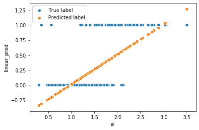
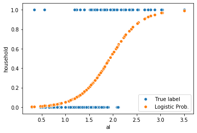
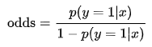
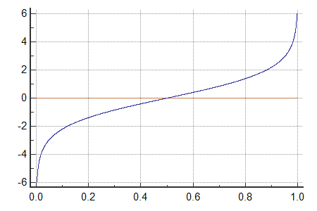
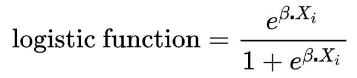

# intro.

로지스틱 회귀에 대해 정리한다.  

# 1. Regression & Classification

회귀(regression)는 다양한 변수들을 이용해 연속형 값을 예측한다.  

- 변수간의 관계를 함수 F로 학습
- `fare` = F(survived, pclass, sex, age, ...)

분류(classification)는 입력 변수로부터 이산형(categorical) 출력을 예측한다.  

- 출력값이 두 종류면 이진분류라 함(생존 여부)
- 출력값이 세 종류 이상이면 멀티클래스 분류라 함(객실 등급)

# 2. Logistic regression

선형 회귀 모델로는 이산형 출력을 모델링 할 수 없다.  

출력값이 1이 될 확률은 연속형 변수이므로 그대로 쓸 수 없다.  

생존 여부와 같은 예/아니오로 분류할 수 있는 문제는 0과 1로 분류되고, 각각의 카테고리로 분류될 확률의 합은 1이다.  

로지스틱 회귀는 선형 호귀와 달리 다음과 같은 특징이 있다.  

- 종속변수 y의 결과의 범위가 `[0, 1]`로 제한됨
- 종속변수가 이진이기 때문에 조건부 확률의 분포가 이항분포

종속 변수 y의 결과가 0아니면 1이기 때문에 단순 선형 회귀로는 학습 품질이 떨어진다. 

로지스틱 회귀식은 독립변수 [-inf, inf]가 어느 수인지에 관계 없이 종속 변수가 항상 [0, 1] 범위에 있도록 해준다. 이는 오즈(odds)를 로짓(logit) 변환 해서 얻어진다.  

## 2.1. Odds

오즈에 대한 자세한 글은 다음 위키를 참조해보자.  

[Odds](https://en.wikipedia.org/wiki/Odds)

개요 부분에 나와 있는 것과 같이 오즈란 이길 확률의 비율, 겜블링에서의 승산을 의미한다.  

예를들어 승률이 80%면 p = 0.8이기 때문에 0.8/0.2 = 4가 된다. 즉 승률이 실패율보다 4배 크다는 사실을 알려준다.  

우선 `선형 회귀(Linear Regression)`를 생각해보자.  

- 출력 범위(종속변수)가 [-inf, inf]
- 확률의 범위는 [0, 1]

이번에는 `오즈(odds)`를 생각해보자.  

- p의 범위 [0, 1]
- p가 0에 수렴: 오즈가 0
- p가 1에 수렴: 오즈가 무한대
- 오즈의 범위: [0, inf]

여기서 로그를 취한 오즈 로짓(logit(p))을 보자.  

이제 출력 범위가 [-inf, inf]로 일치한다.  

