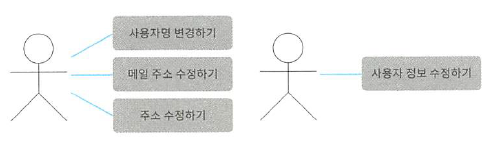

# 1. 애플리케이션 서비스란 무엇인가?

> 애플리케이션 서비스를 한 마디로 표현하면 유스케이스를 구현하는 객체라고 할 수 있다.  
>  
> 예를 들어 사용자 등록을 해야 하는 시스템에서 사용자 기능을 구현하려면 `사용자 등록하기` 유스케이스와 `사용자 정보 수정하기` 유스케이스가 필요하다.  

# 2. 유스케이스 수립하기

## 2.1. 도메인 객체 준비하기

- 사용자 엔티티
- 사용자명 중복 여부 확인을 위한 도메인 서비스
- 사용자 리포지토리

## 2.2. 사용자 등록 처리 구현하기

## 2.3. 사용자 정보 확인 처리 구현하기

## 2.4. 사용자 정보 수정 처리 구현하기

- 커맨드 객체

## 2.5. 탈퇴 처리 구현하기

# 3. 도메인 규칙의 유출

> 애플리케이션 서비스는 도메인 객체가 수행하는 태스크를 조율하는 데만 전념해야 한다. 따라서 애플리케이션 서비스에 도메인 규칙을 기술해서는 안 된다.

# 4. 애플리케이션 서비스와 프로그램의 응집도

> 응집도를 측정하는 방법에는 LCOM(Lack of Conhesion in Methods)라는 방식이 있다.  

## 4.1. 응집도가 낮은 애플리케이션 서비스